

  <a href="https://github.com/choucisan/awesome-designer-fonts">
    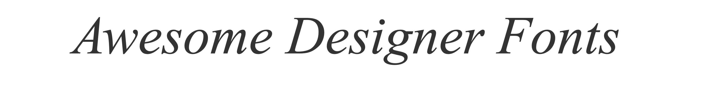
  </a>

  <i>"If I had never dropped in on that single calligraphy course in college, the Mac would have never had multiple typefaces or proportionally spaced fonts."</i> 
                                                                  — Steve Jobs

<h4 align="center">A visual, practical collection of fonts for designers.</h4>

  
  
  
  

## Motivation

Great fonts are often discovered one post, screenshot, or design thread at a time. Awesome Designer Fonts brings together typefaces frequently used and recommended by experienced software, product, and visual designers across social media. Each entry adds the practical details that are usually missing: what the font looks like, where it works best, whether it can be used commercially, and where to find its official source.

The collection currently includes **33 fonts**: **19 are free for commercial use**, **12 require a paid license**, and **2 have restricted use**. Always review the linked license before using a font in a project.

Know a font that belongs here, or spot something that needs improving? Pull requests are welcome.

## All Fonts

- [Awesome Serif](#awesome-serif)
- [Axiforma](#axiforma)
- [Berkeley Mono](#berkeley-mono)
- [Be Vietnam Pro](#be-vietnam-pro)
- [Bricolage Grotesque](#bricolage-grotesque)
- [Bunch](#bunch)
- [Caros](#caros)
- [Coolvetica](#coolvetica)
- [Darker Grotesque](#darker-grotesque)
- [DM Mono](#dm-mono)
- [DM Sans](#dm-sans)
- [DM Serif Display](#dm-serif-display)
- [Figtree](#figtree)
- [Geist](#geist)
- [Google Sans](#google-sans)
- [Helvetica Neue](#helvetica-neue)
- [IBM Plex Sans](#ibm-plex-sans)
- [Instrument Sans](#instrument-sans)
- [Instrument Serif](#instrument-serif)
- [Inter](#inter)
- [JetBrains Mono](#jetbrains-mono)
- [Metropolis](#metropolis)
- [Myopic](#myopic)
- [Neue Montreal](#neue-montreal)
- [Neurial Grotesk](#neurial-grotesk)
- [Overused Grotesk](#overused-grotesk)
- [Poppins](#poppins)
- [Plus Jakarta Sans](#plus-jakarta-sans)
- [Rethink Sans](#rethink-sans)
- [SF Pro](#sf-pro)
- [Switzer](#switzer)
- [Tusker Grotesk](#tusker-grotesk)
- [Youth](#youth)

## Awesome Serif

An elegant font with small finishing strokes and strong differences between thick and thin lines. It feels expressive and polished rather than neutral.

| | |
| --- | --- |
| Best for | Branding, editorial design, packaging, social media |
| Designer | Nicky Laatz |
| Commercial use | Paid license required |
| Variable font | No |
| Similar fonts | Recoleta, Canela, Cormorant Garamond |

[Preview styles and buy Awesome Serif](https://nickylaatz.com/shop/308-awesome-serif-family) | [Read the license](https://nickylaatz.com/eula)

## Axiforma

A geometric font made from smooth, rounded shapes. Its large family works across clean interfaces, brand systems, and longer editorial layouts.

| | |
| --- | --- |
| Best for | Brand identity, UI design, editorial design, web design |
| Designer | Galin Kastelov |
| Commercial use | Paid license required |
| Variable font | No |
| Similar fonts | Circular, Avenir, Poppins |

[Preview styles and buy Axiforma](https://www.myfonts.com/collections/axiforma-font-kastelov)

## Berkeley Mono

A precise fixed-width font inspired by early computers and technical displays. It combines nostalgic terminal details with clear modern drawing.

| | |
| --- | --- |
| Best for | Code, terminals, data displays, technical branding |
| Designer | Sam Ratcliffe |
| Commercial use | Paid license required |
| Variable font | No |
| Similar fonts | JetBrains Mono, IBM Plex Mono, SF Mono |

[Preview styles and buy Berkeley Mono](https://usgraphics.com/products/berkeley-mono)

## Be Vietnam Pro

<a href="https://fonts.google.com/specimen/Be+Vietnam+Pro">
  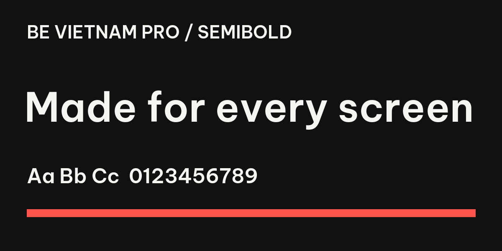
</a>

A clear contemporary font built to handle Vietnamese and Latin text well. Its open shapes make it comfortable in interfaces, websites, and longer text.

| | |
| --- | --- |
| Best for | Multilingual design, UI design, web design, editorial text |
| Designer | Lam Bao, Tony Le, VietAnh Nguyen |
| Commercial use | Free under SIL Open Font License 1.1 |
| Variable font | No |
| Similar fonts | Noto Sans, Inter, IBM Plex Sans |

[Download Be Vietnam Pro from Google Fonts](https://fonts.google.com/specimen/Be+Vietnam+Pro) | [Read the license](https://openfontlicense.org/)

## Bricolage Grotesque

An expressive font that changes character across its width and optical-size settings. Narrow styles look bold and unusual, while smaller text styles are calmer and easier to read.

| | |
| --- | --- |
| Best for | Brand identity, editorial headlines, web design, campaigns |
| Designer | Mathieu Triay |
| Commercial use | Free under SIL Open Font License 1.1 |
| Variable font | Yes |
| Similar fonts | Archivo, Anybody, Roboto Flex |

[Download Bricolage Grotesque from Google Fonts](https://fonts.google.com/specimen/Bricolage+Grotesque) | [Read the license](https://openfontlicense.org/)

## Bunch

A bold font with compact proportions and heavy, tightly packed shapes. It makes short text feel direct and energetic.

| | |
| --- | --- |
| Best for | Brand identity, headlines, posters, campaigns |
| Designer | Cristi Bordeianu, Andrei Robu |
| Commercial use | Paid license required |
| Variable font | Yes |
| Similar fonts | Monument Grotesk, Druk, Archivo Black |

[Preview styles and buy Bunch](https://typeverything.com/bunch)

## Caros

A clean font built from simple, rounded shapes. Its 18 styles make it useful for both large titles and everyday text.

| | |
| --- | --- |
| Best for | Branding, web design, editorial design, screen displays |
| Designer | Hyun-Seung Lee |
| Commercial use | Paid license required |
| Variable font | No |
| Similar fonts | Avenir, Futura, Montserrat |

[Preview styles and buy Caros](https://www.myfonts.com/collections/caros-font-cretype)

## Coolvetica

A retro, tightly spaced font inspired by 1970s logo lettering. It is designed
to attract attention at large sizes, not for long paragraphs.

| | |
| --- | --- |
| Best for | Logos, branding, headlines, posters |
| Designer | Ray Larabie |
| Commercial use | Paid license required |
| Variable font | No |
| Similar fonts | Helvetica, ITC Avant Garde Gothic, Futura |

[Preview styles and buy Coolvetica](https://typodermicfonts.com/coolvetica/) | [Read the license](https://typodermicfonts.com/license/)

## Darker Grotesque

<a href="https://fonts.google.com/specimen/Darker+Grotesque">
  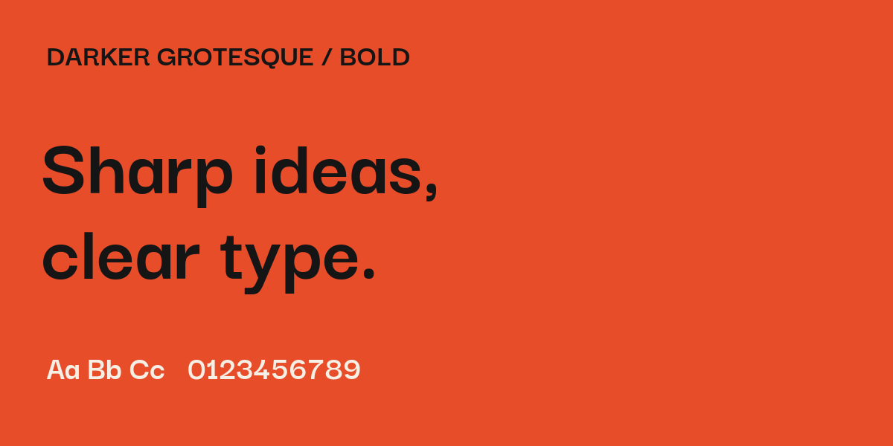
</a>

A contemporary font with close spacing and slightly unconventional letter shapes. It feels sharper and more distinctive than a neutral interface font.

| | |
| --- | --- |
| Best for | Brand identity, editorial design, web design, posters |
| Designer | Gabriel Lam, VietAnh Nguyen |
| Commercial use | Free under SIL Open Font License 1.1 |
| Variable font | Yes |
| Similar fonts | Space Grotesk, Neue Haas Grotesk, Helvetica Neue |

[Download Darker Grotesque from Google Fonts](https://fonts.google.com/specimen/Darker+Grotesque) | [Read the license](https://openfontlicense.org/)

## DM Mono

<a href="https://fonts.google.com/specimen/DM+Mono">
  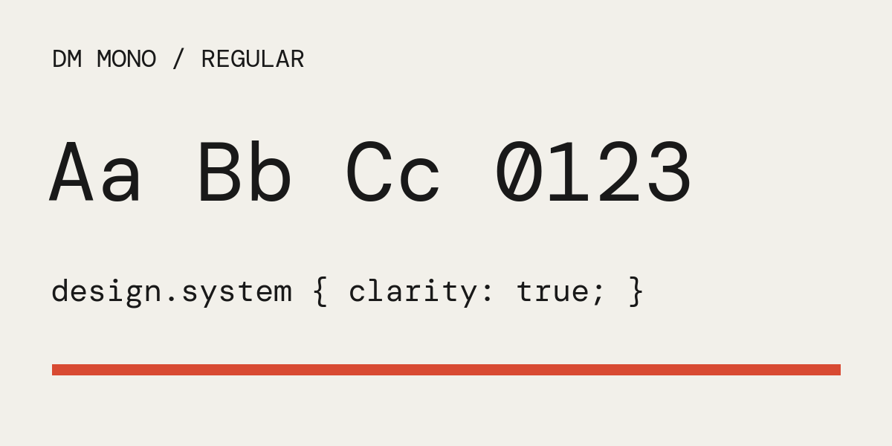
</a>

A compact fixed-width font where every character occupies the same amount of space. Its softer shapes make technical text feel less mechanical.

| | |
| --- | --- |
| Best for | Code, data displays, technical interfaces, editorial details |
| Designer | Colophon Foundry |
| Commercial use | Free under SIL Open Font License 1.1 |
| Variable font | No |
| Similar fonts | IBM Plex Mono, Space Mono, Roboto Mono |

[Download DM Mono from Google Fonts](https://fonts.google.com/specimen/DM+Mono) | [Read the license](https://openfontlicense.org/)

## DM Sans

<a href="https://fonts.google.com/specimen/DM+Sans">
  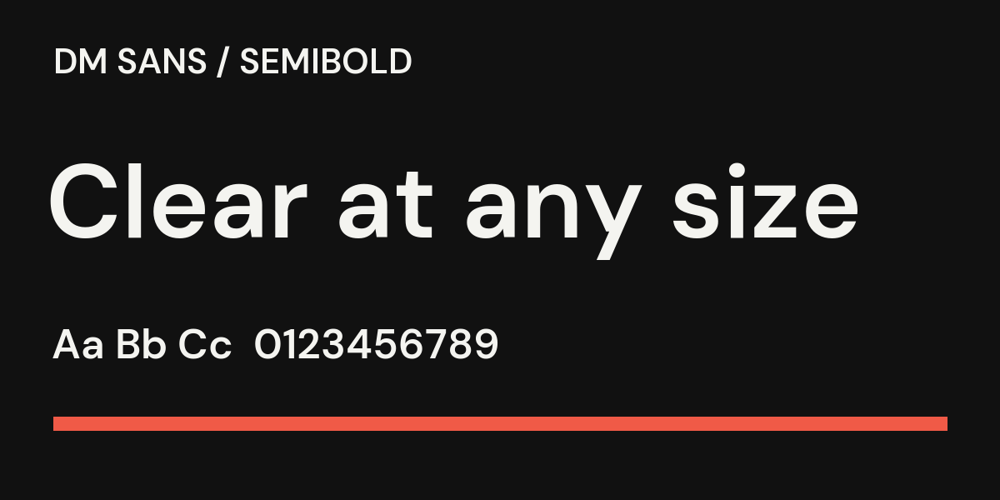
</a>

A clean geometric font designed to remain readable at smaller sizes. It feels friendly and neutral enough for everyday product interfaces.

| | |
| --- | --- |
| Best for | UI design, web design, mobile apps, body text |
| Designer | Colophon Foundry |
| Commercial use | Free under SIL Open Font License 1.1 |
| Variable font | Yes |
| Similar fonts | Inter, Manrope, Geist |

[Download DM Sans from Google Fonts](https://fonts.google.com/specimen/DM+Sans) | [Read the license](https://openfontlicense.org/)

## DM Serif Display

A dramatic font with decorative finishing strokes and bold differences between thick and thin lines. It is made for large, elegant text rather than body copy.

| | |
| --- | --- |
| Best for | Editorial headlines, branding, web headers, invitations |
| Designer | Colophon Foundry |
| Commercial use | Free under SIL Open Font License 1.1 |
| Variable font | No |
| Similar fonts | Playfair Display, Bodoni Moda, Cormorant Garamond |

[Download DM Serif Display from Google Fonts](https://fonts.google.com/specimen/DM+Serif+Display) | [Read the license](https://openfontlicense.org/)

## Figtree

<a href="https://fonts.google.com/specimen/Figtree">
  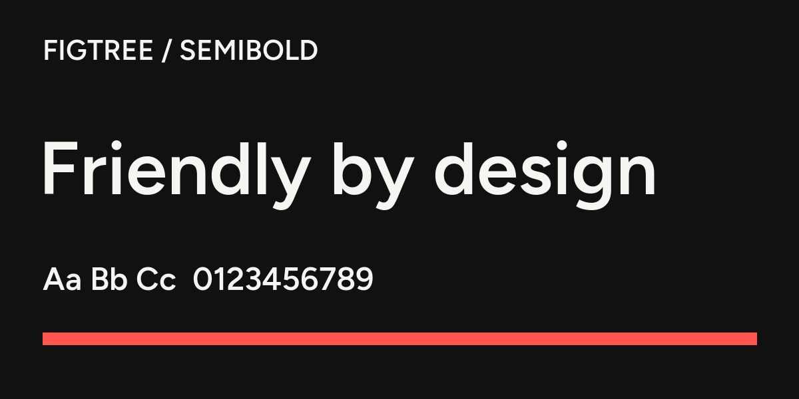
</a>

A friendly geometric font with simple, open shapes. It stays clear on screens without feeling as rigid as a neutral corporate font.

| | |
| --- | --- |
| Best for | UI design, web design, presentations, body text |
| Designer | Erik Kennedy |
| Commercial use | Free under SIL Open Font License 1.1 |
| Variable font | Yes |
| Similar fonts | Inter, DM Sans, Manrope |

[Download Figtree from Google Fonts](https://fonts.google.com/specimen/Figtree) | [Read the license](https://openfontlicense.org/)

## Geist

<a href="https://vercel.com/font">
  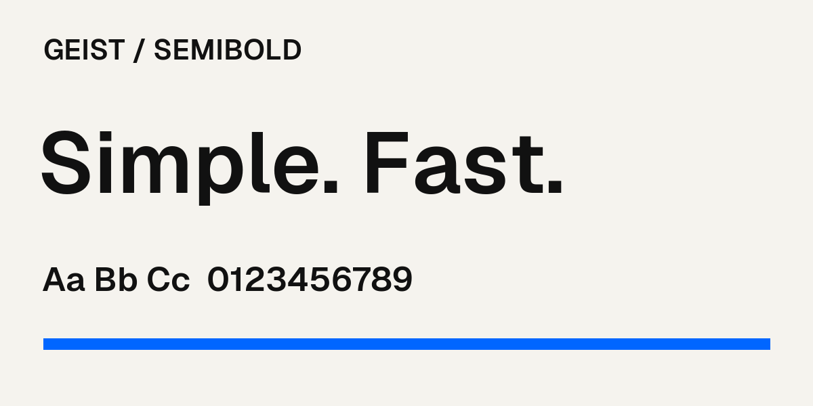
</a>

A compact, neutral font created for modern digital products. Its spacing and clear shapes work especially well in dense interfaces and developer tools.

| | |
| --- | --- |
| Best for | UI design, SaaS, developer tools, web design |
| Designer | Vercel and collaborators |
| Commercial use | Free under SIL Open Font License 1.1 |
| Variable font | Yes |
| Similar fonts | Inter, SF Pro, Helvetica Now |

[Download Geist from Vercel](https://vercel.com/font) | [Read the license](https://openfontlicense.org/)

## Google Sans

<a href="https://fonts.google.com/specimen/Google+Sans">
  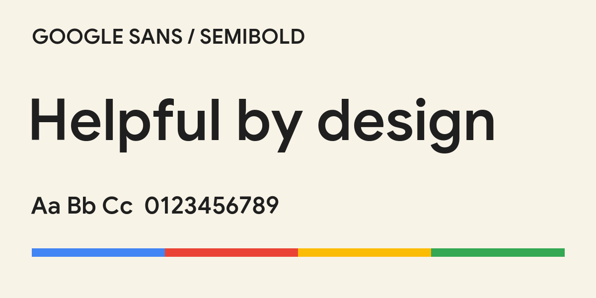
</a>

A geometric font derived from Product Sans and adapted for Google's products, advertising, and marketing. Its soft curves make interface text feel approachable.

| | |
| --- | --- |
| Best for | Google products, product interfaces, brand systems, marketing |
| Designer | Google LLC |
| Commercial use | Restricted - not offered for general third-party use |
| Variable font | Yes |
| Similar fonts | Product Sans, DM Sans, Circular |

[View Google Sans on Google Fonts](https://fonts.google.com/specimen/Google+Sans) | [Read Google's license note](https://github.com/googlefonts/googlesans#license)

## Helvetica Neue

A neutral, highly controlled font that stays out of the way. It works when the layout and information should speak louder than the typeface.

| | |
| --- | --- |
| Best for | Brand identity, editorial design, wayfinding, corporate communications |
| Designer | Max Miedinger, Linotype Design Studio |
| Commercial use | Paid license required |
| Variable font | No |
| Similar fonts | Helvetica Now, Arial, Nimbus Sans |

[Preview styles and buy Helvetica Neue](https://www.myfonts.com/collections/neue-helvetica-font-linotype)

## IBM Plex Sans

<a href="https://fonts.google.com/specimen/IBM+Plex+Sans">
  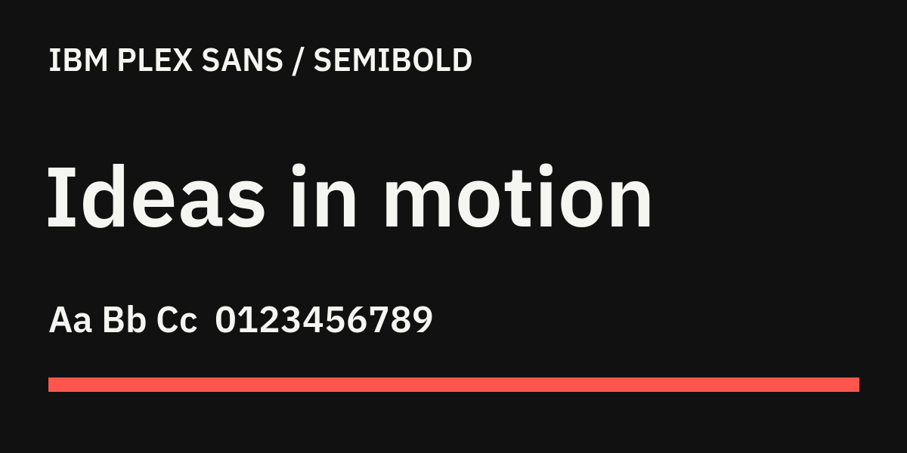
</a>

A practical font that mixes technical precision with warmer, more human details. Its large family works well when one visual system needs to handle many kinds of information.

| | |
| --- | --- |
| Best for | Product design, editorial design, data interfaces, brand systems |
| Designer | Mike Abbink, Bold Monday |
| Commercial use | Free under SIL Open Font License 1.1 |
| Variable font | Yes |
| Similar fonts | Inter, Source Sans 3, Helvetica Neue |

[Download IBM Plex Sans from Google Fonts](https://fonts.google.com/specimen/IBM+Plex+Sans) | [Read the license](https://openfontlicense.org/)

## Instrument Sans

<a href="https://fonts.google.com/specimen/Instrument+Sans">
  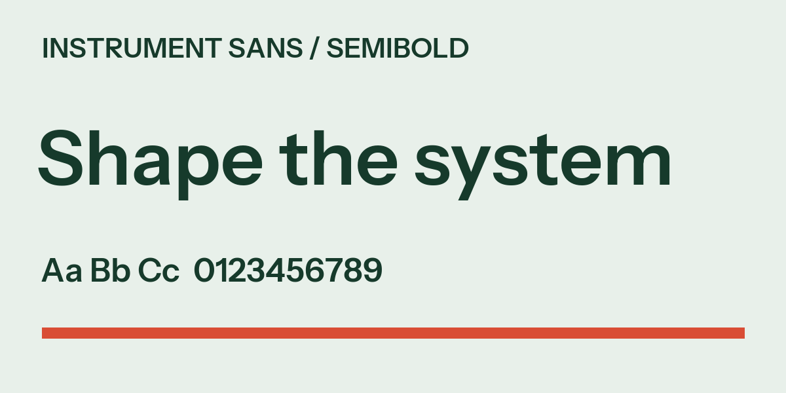
</a>

A practical font with adjustable width and weight. It can stay quiet in an interface or become more distinctive in large headlines.

| | |
| --- | --- |
| Best for | Brand identity, UI design, editorial design, portfolio websites |
| Designer | Rodrigo Fuenzalida, Jordan Egstad |
| Commercial use | Free under SIL Open Font License 1.1 |
| Variable font | Yes |
| Similar fonts | Inter, Neue Montreal, Helvetica Neue |

[Download Instrument Sans from Google Fonts](https://fonts.google.com/specimen/Instrument+Sans) | [Read the license](https://openfontlicense.org/)

## Instrument Serif

A narrow font with distinctive finishing strokes. It feels editorial and contemporary, and is most effective when used large.

| | |
| --- | --- |
| Best for | Branding, editorial headlines, campaigns, portfolio websites |
| Designer | Rodrigo Fuenzalida, with direction from Jordan Egstad |
| Commercial use | Free under SIL Open Font License 1.1 |
| Variable font | No |
| Similar fonts | Cormorant Garamond, DM Serif Display, Iowan Old Style |

[Download Instrument Serif from Google Fonts](https://fonts.google.com/specimen/Instrument+Serif) | [Read the license](https://openfontlicense.org/)

## Inter

A clear, practical font built for screens. It remains readable in dense user interfaces and at small sizes.

| | |
| --- | --- |
| Best for | UI design, SaaS products, mobile apps, websites |
| Designer | Rasmus Andersson |
| Commercial use | Free under SIL Open Font License 1.1 |
| Variable font | Yes |
| Similar fonts | SF Pro, Helvetica Neue |

[Download Inter from the official website](https://rsms.me/inter/) | [Read the license](https://openfontlicense.org/)

## JetBrains Mono

<a href="https://www.jetbrains.com/lp/mono/">
  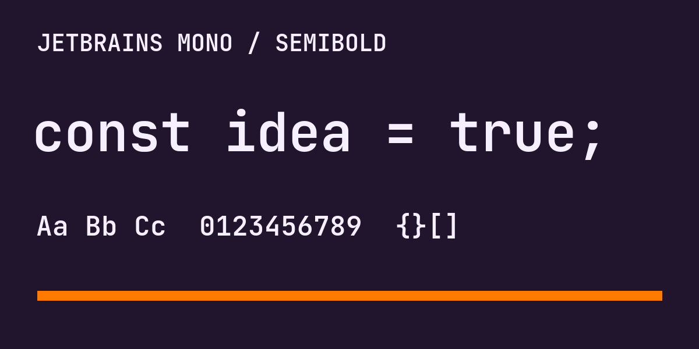
</a>

A fixed-width font designed specifically for code. Tall lowercase letters improve scanning, while optional ligatures combine common programming symbols.

| | |
| --- | --- |
| Best for | Code, developer tools, terminals, technical documentation |
| Designer | JetBrains, Philipp Nurullin, Konstantin Bulenkov |
| Commercial use | Free under SIL Open Font License 1.1 |
| Variable font | Yes |
| Similar fonts | Berkeley Mono, IBM Plex Mono, Fira Code |

[Download JetBrains Mono from JetBrains](https://www.jetbrains.com/lp/mono/) | [Read the license](https://openfontlicense.org/)

## Metropolis

<a href="https://github.com/typehaus/metropolis">
  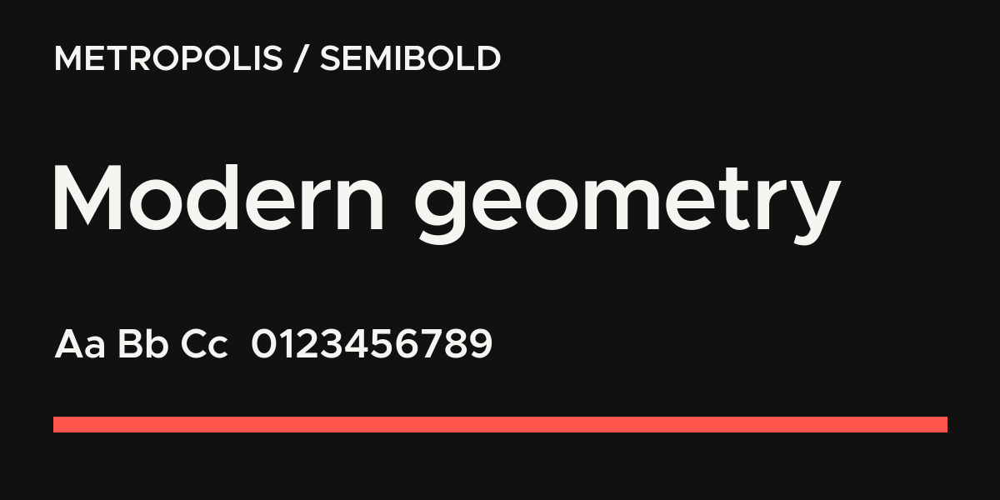
</a>

A minimalist font made from clean geometric shapes. It remains readable when small but has enough structure to make large titles feel modern and precise.

| | |
| --- | --- |
| Best for | Brand identity, web design, presentations, headlines |
| Designer | Chris Simpson |
| Commercial use | Free under The Unlicense |
| Variable font | No |
| Similar fonts | Montserrat, Gotham, Proxima Nova |

[Download Metropolis from the maintained GitHub project](https://github.com/typehaus/metropolis) | [Read the license](https://github.com/typehaus/metropolis/blob/main/license.md)

## Myopic

A narrow pixel font built from modular digital shapes. It has a deliberately early-computer appearance that is best used in short, prominent text.

| | |
| --- | --- |
| Best for | Posters, experimental web design, album artwork, technology branding |
| Designer | Brian Einarsen |
| Commercial use | Paid license required |
| Variable font | No |
| Similar fonts | Silkscreen, Pixel Operator, OCR-A |

[Preview styles and buy Myopic](https://www.myfonts.com/collections/myopic-font-t-26)

## Neue Montreal

A versatile font that balances neutral everyday shapes with enough character for branding. Dedicated text styles keep it readable at smaller sizes.

| | |
| --- | --- |
| Best for | Brand identity, UI design, editorial design, web design |
| Designer | Mathieu Desjardins |
| Commercial use | Paid license required |
| Variable font | Yes |
| Similar fonts | Helvetica Neue, Suisse Intl, Neue Haas Grotesk |

[Preview styles and buy Neue Montreal](https://pangrampangram.com/products/neue-montreal)

## Neurial Grotesk

A compact modernist font with tall lowercase letters, so more text fits without becoming difficult to read. Alternate letter shapes let it move from restrained to more distinctive branding.

| | |
| --- | --- |
| Best for | Brand identity, corporate design, editorial design, web design |
| Designer | Deni Anggara |
| Commercial use | Paid license required |
| Variable font | No |
| Similar fonts | Neue Montreal, Helvetica Neue, Suisse Intl |

[Preview styles and buy Neurial Grotesk](https://www.myfonts.com/collections/neurial-grotesk-font-indian-type-foundry)

## Overused Grotesk

<a href="https://github.com/RandomMaerks/Overused-Grotesk">
  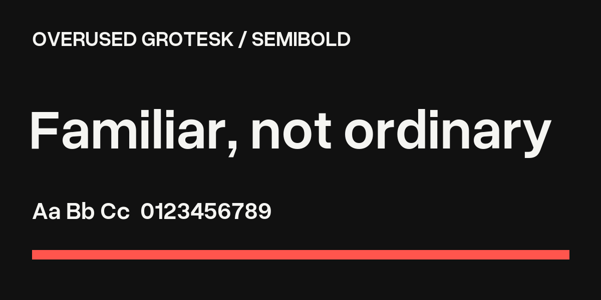
</a>

A familiar-looking font inspired by Helvetica, but with quirkier details and a less serious tone. It offers a broad character set for multilingual work.

| | |
| --- | --- |
| Best for | Brand identity, web design, editorial design, posters |
| Designer | Random Maerks |
| Commercial use | Free under SIL Open Font License 1.1 |
| Variable font | Yes |
| Similar fonts | Helvetica Neue, Arial, Nimbus Sans |

[Download Overused Grotesk from GitHub](https://github.com/RandomMaerks/Overused-Grotesk) | [Read the license](https://openfontlicense.org/)

## Poppins

<a href="https://fonts.google.com/specimen/Poppins">
  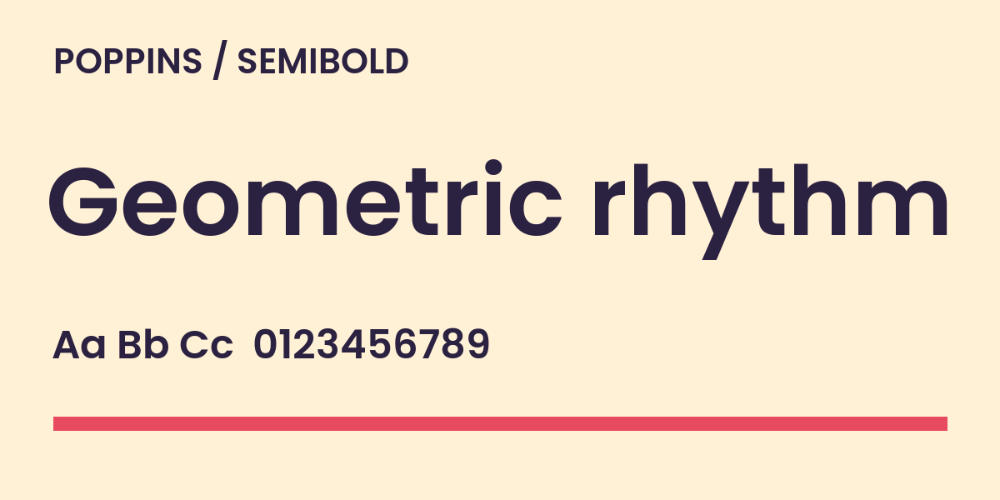
</a>

A geometric font based on circles and simple strokes. Its broad weight range and matching Devanagari design make it useful for multilingual visual systems.

| | |
| --- | --- |
| Best for | Brand identity, web design, presentations, headlines |
| Designer | Indian Type Foundry, Jonny Pinhorn, Ninad Kale |
| Commercial use | Free under SIL Open Font License 1.1 |
| Variable font | No |
| Similar fonts | Montserrat, Axiforma, Circular |

[Download Poppins from Google Fonts](https://fonts.google.com/specimen/Poppins) | [Read the license](https://openfontlicense.org/)

## Plus Jakarta Sans

<a href="https://fonts.google.com/specimen/Plus+Jakarta+Sans">
  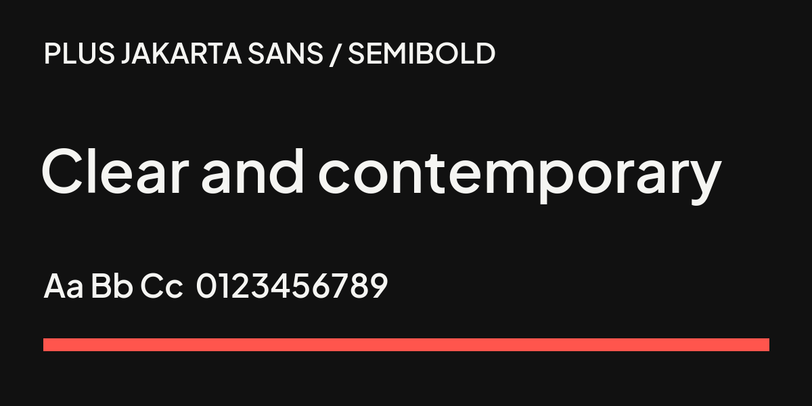
</a>

A clean geometric font with open shapes and a contemporary feel. Its wide weight range makes it useful from quiet interface text to bold brand headlines.

| | |
| --- | --- |
| Best for | UI design, brand identity, web design, presentations |
| Designer | Tokotype |
| Commercial use | Free under SIL Open Font License 1.1 |
| Variable font | Yes |
| Similar fonts | Poppins, Circular, DM Sans |

[Download Plus Jakarta Sans from Google Fonts](https://fonts.google.com/specimen/Plus+Jakarta+Sans) | [Read the license](https://openfontlicense.org/)

## Rethink Sans

<a href="https://fonts.google.com/specimen/Rethink+Sans">
  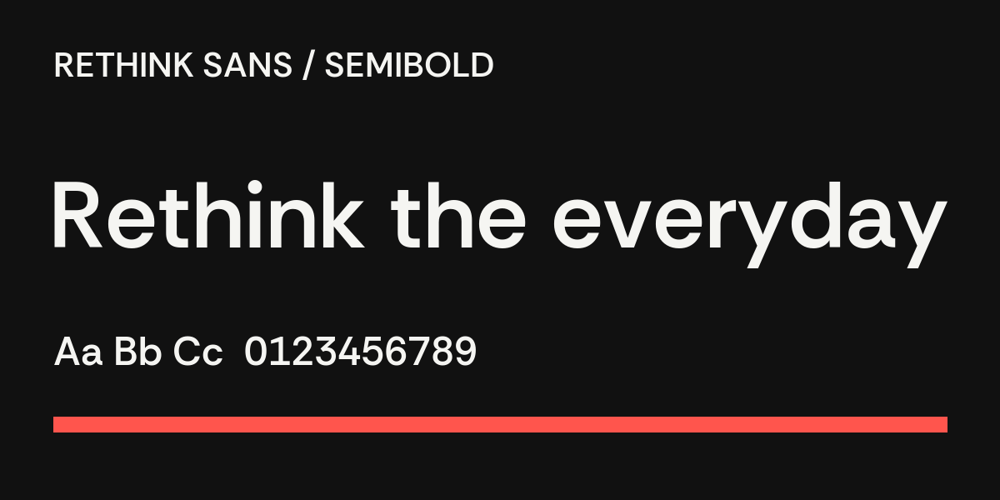
</a>

A versatile contemporary font with practical proportions and subtle unusual details. It stays readable in everyday layouts while giving a brand more personality than a purely neutral font.

| | |
| --- | --- |
| Best for | Brand identity, UI design, web design, editorial design |
| Designer | Hans Thiessen |
| Commercial use | Free under SIL Open Font License 1.1 |
| Variable font | Yes |
| Similar fonts | DM Sans, Figtree, Inter |

[Download Rethink Sans from Google Fonts](https://fonts.google.com/specimen/Rethink+Sans) | [Read the license](https://openfontlicense.org/)

## SF Pro

<a href="https://developer.apple.com/fonts/">
  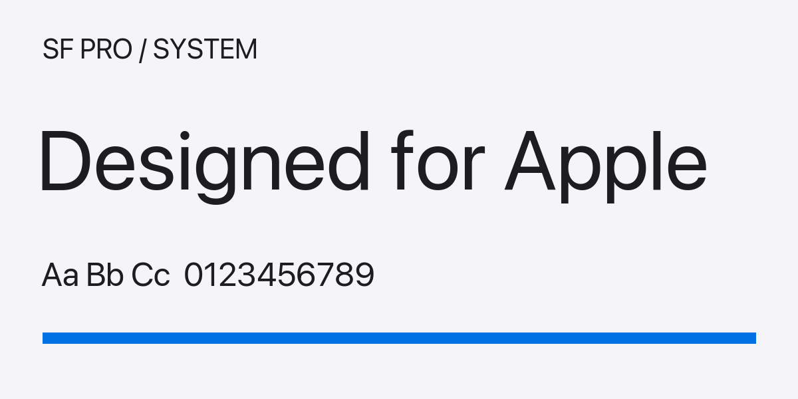
</a>

Apple's neutral system font is designed for highly readable product interfaces. It includes nine weights, four widths, and optical sizes that adapt to text size.

| | |
| --- | --- |
| Best for | Apple platform UI, app mock-ups, product interfaces, prototyping |
| Designer | Apple Design Team |
| Commercial use | Restricted to uses allowed by the Apple font license |
| Variable font | Yes |
| Similar fonts | Inter, Helvetica Neue, Geist |

[View and download SF Pro from Apple](https://developer.apple.com/fonts/) | [Review Apple's font terms](https://developer.apple.com/fonts/)

## Switzer

<a href="https://www.fontshare.com/fonts/switzer">
  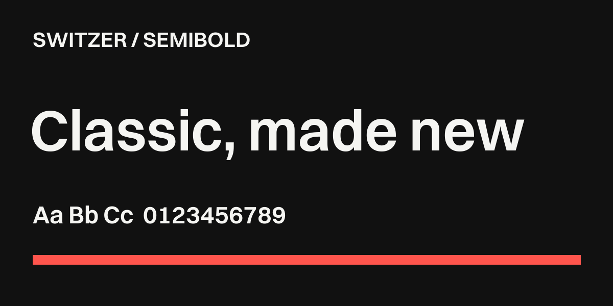
</a>

A classic, neutral-looking font with nine weights and matching italics. It is flexible enough for brand systems, editorial layouts, websites, and large headlines.

| | |
| --- | --- |
| Best for | Brand identity, editorial design, web design, posters |
| Designer | Jeremie Hornus |
| Commercial use | Free under ITF Free Font License |
| Variable font | Yes |
| Similar fonts | Helvetica Neue, Neue Montreal, Suisse Intl |

[Download Switzer from Fontshare](https://www.fontshare.com/fonts/switzer) | [Read the license](https://www.fontshare.com/licenses/itf-ffl)

## Tusker Grotesk

A very narrow, heavy font made to fill headlines with maximum impact. Its 30 styles range from tall and compressed to wider, solid display lettering.

| | |
| --- | --- |
| Best for | Headlines, posters, campaigns, sports branding |
| Designer | Lewis McGuffie |
| Commercial use | Paid license required |
| Variable font | No |
| Similar fonts | Impact, Haettenschweiler, Anton |

[Preview styles and buy Tusker Grotesk](https://www.myfonts.com/collections/tusker-grotesk-font-lewis-mcguffie-type)

## Youth

A bold font with simple shapes, soft corners, and playful proportions. It has a strong personality suited to short, prominent text.

| | |
| --- | --- |
| Best for | Brand identity, headlines, posters, editorial leads |
| Designer | Jan Novák |
| Commercial use | Paid license required |
| Variable font | Available from AllCaps on request |
| Similar fonts | ITC Avant Garde Gothic, Futura, Bauhaus 93 |

[Preview styles and buy Youth](https://www.allcapstype.com/typefaces/youth) | [Read the license](https://www.allcapstype.com/licencing#user-content-end-user-licence-agreement-eula)

## About This Collection

[`fonts/fonts.json`](fonts/fonts.json) is the source of truth for font details and preview sources. See the [font data guide](fonts/README.md) for field definitions.

This repository does not redistribute font files. Free fonts link to their official download pages; commercial fonts link to the creator or an authorized retailer. Always confirm that the license covers your intended use before starting a commercial project.

Preview images are loaded from official creator, foundry, project, or authorized retailer pages and remain the property of their respective owners. Repository metadata and editorial descriptions are released under [CC0 1.0](LICENSE).

A variable font provides adjustable weights or other styles from one font file. It is useful for flexible web and interface design, but is not required for normal font use.

## 📮 Contact

For questions, corrections, or collaboration requests:

[choucisan@gmail.com](mailto:choucisan@gmail.com)
